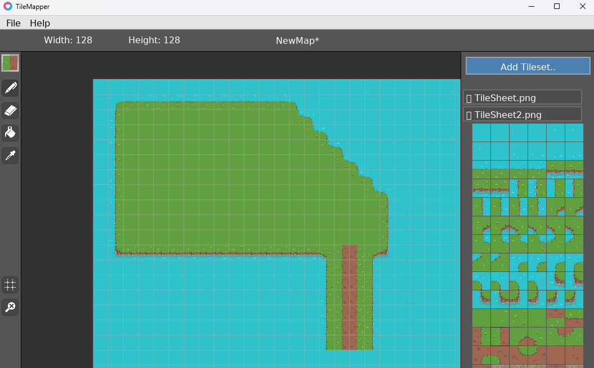

# TileMapper

Built from a fork from mDerams 2DMapEditor https://github.com/mDeram/2DMapEditor
But almost completely remade, almost nothing remain of nor old logic nor visuality hence why license now stands under myself for this.

2D map editor (Windows only currently) with support using Windows native dialogue to import .png tilesets into app [src/assets/tileset]
Supports multiple tileset import at righthand panel where maps are also drawn in a multi-array that way [0:0;1:0] where by export a tilesetIndex.txt is accompanied to the same export folder by choice so your game will know what tileset has what index. These must of course also be identical to your game.

Currently supports import and export to both .txt, json and lua since this is built mostly by help of LOVE2D engine: https://love2d.org/

## Preview



## Features - (Default click is left mousebutton unless otherwise specified)

```Top Menu Bar```

- New map ( - exactly the same as welcome modal on startup)
	- Set mapName
	- Set mapsize (x + y)
	- Set tilesize (square)
- Import & Export:
	- .txt
	- .json
	- .lua
- About App
- Controls
	- Displays current mapped keys - no user custom feature available

---

```Left Panel - in actual order from up to down in app```

- Preview:
	- Preview what tile currently selected
- Editing:
	- Draw Tiles
	- Erase Tiles
	- Fill Area
	- TilePicker
- Display:
	- Toggle visual grid on/off
	- Reset position to grid center
- Clear map:
	- Clear entire map (still possible to use ctrl+z after) 
---

```Right Panel```
- Tiles display as multiple drawing palettes, where by click expand or collapse one tileset, choose tile by click and either draw or fill (depending on tool selected in left panel) grid with selected tile.
- Scroll is possible so theres really no limit as to how many tilesets or size can be added.

---
```Grid/Movement```
- Move grid by keyboard or right mouse(hold)
- Zoom by mousewheel or +/- on numkeypad
---
```General window settings```
- Fullscreen mode or whatever size of window preferred, default 1200x760
---
```Confirmation and user-fumble-protection settings```
- Confirmation modals if forgot to export before new map or close with unexported settings.
- General fault-handling if somethings off
---

## Get started

1.
	- Download and install LOVE2D from https://love2d.org (required since engine to run this app)
	- Download this repository and unzip and place in folder by choice.   
---
2. 
	- Locate AutomateExport.bat scriptbatch file in this repofolder, and locate this line
	```REM -- ADJUST THIS --``` and adjust to filepath where LOVE2D where just installed.
	- Click AutomateExport.bat which now runs a script to first zip all content in src- folder and concatenates game.love with love.exe and renders the output name to TileMapper.exe
---  
3.
	- Double-click TileMapper.exe to run app.
---
4. 
	- Create a new map with values of choosing by welcome modal. Tilesize are by equal square pixel size.
	- Add whatever tilesets (.png) you'd like to righthand panel. Just one or several.
	- Start drawing map
	- Export map in chosen format [.txt, .json, .lua] to local destination of choice. An accompanied tilesetIndex.txt will follow so your game will know what tileset have which index.

## Project Status
- Currently version 0.85 (ca) i would like to say. Greatly improved by first fork and wont rule out improving further if gamemaking goes further.

## Why this Project
- Im deeply fascinated and into developing own 2D games (currently) and have my own engine which is used to make games but was missing a solid and simple-to-use Windows map editor and found this base to work further from. Simplicity is still key, as stated from first maker of this project